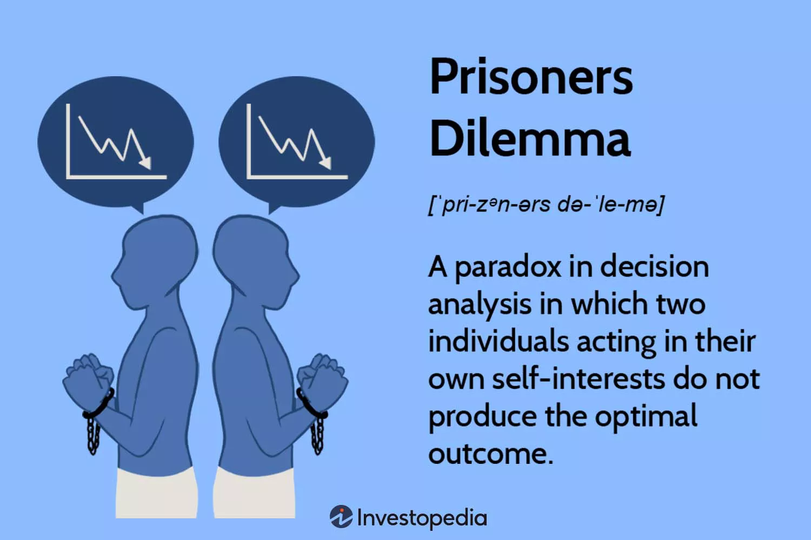

We usually think that if everyone makes the best choice for themselves, the final result should also be good. However, this is not always true. The **Prisoner's Dilemma** shows how two people can make rational choices but still end up with a worse result for both.

Imagine that two suspects, A and B, are arrested and questioned separately. They cannot talk to each other. Each person has two choices: **stay silent** or **confess**.

If both stay silent, they each spend one year in prison. If one confesses and the other stays silent, the person who confesses goes free, while the other person spends five years in prison. If both confess, they each spend three years in prison.

$$\begin{array}{c|cc}
 & \text{B Stays Silent} & \text{B Confesses} \\
\hline
\text{A Stays Silent} & (1,1) & (5,0) \\
\text{A Confesses} & (0,5) & (3,3)
\end{array}$$
Now think about the situation from A's point of view. If B stays silent, A should confess because going free is better than spending one year in prison. If B confesses, A should still confess because three years in prison is better than five years.

So, no matter what B does, confessing is the better choice for A. B will think in the same way. In the end, both of them confess and each spends three years in prison.

But this creates a strange result. If both of them had stayed silent, they would have spent only one year in prison. They both made the best choice for themselves, but they ended up with a worse result.

This is what makes the Prisoner's Dilemma interesting. Neither person is making a bad decision. From each person's point of view, confessing makes sense. The problem is that when both people make the same rational choice, the final result is worse for both of them.

We can also see this idea in economics. Imagine two companies selling similar products. Both companies can keep their prices high or lower their prices. If both keep their prices high, they can both make good profits. However, each company has a reason to lower its price. If the other company keeps a high price, lowering the price may attract more customers. If the other company lowers its price, the company may also need to lower its price to avoid losing customers.

As a result, both companies may lower their prices and start a price war. In the end, both companies may make less profit. Just like the two prisoners, each company is trying to make the best decision for itself, but the final result can be worse for everyone.

The main lesson of the Prisoner's Dilemma is simple: the best choice for each person is not always the best choice for the group. It also helps explain why cooperation can be difficult. Even when cooperation could make everyone better off, people may still have a reason to choose what is best for themselves.

{width="700px"}

*Figure 1: The basic idea of the Prisoner's Dilemma. Source: Investopedia.*

---
