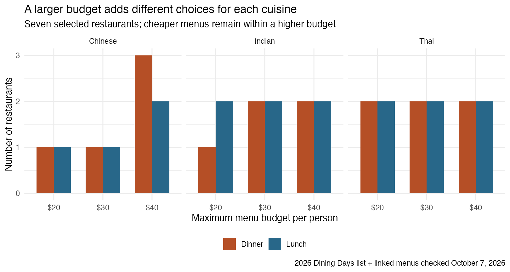
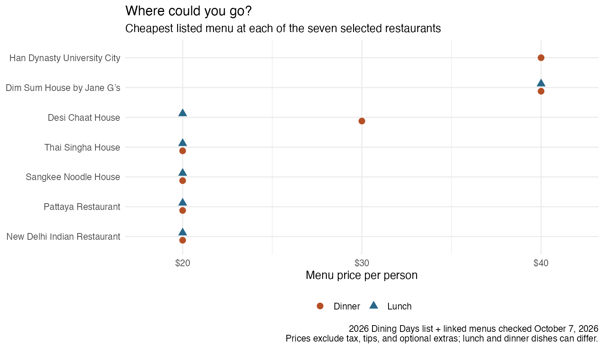

```{r}
#| include: false
source("code/analysis.R")
```

The group chat has agreed on dinner. Now someone wants Indian food, someone else wants Thai, and nobody wants to spend too much. A long restaurant list helps, but it does not answer the next question: would a bigger budget give us more places we actually want to try?

I looked at the 2026 University City Dining Days event, where restaurants offered set menus at $20, $30, and $40. My question is whether spending more, or meeting for lunch, adds choices for a particular cuisine. For a student, another $10 per person is not a small change. For four friends, it adds $40 before tax and tips. The useful comparison is therefore what that extra money makes possible, not just which price group has the longest list. I compare two decisions: keeping the meal time and raising the budget, or keeping the budget and meeting earlier. Neither helps unless it adds something the group wants.

I used R and rvest to collect names, meal types, prices, and links from the [official participant list](https://www.universitycity.org/diningdays/), first accessed on September 19, 2026. The saved list has `r nrow(restaurants)` restaurant–meal–price entries. I removed extra spaces and checked duplicates within each group. Cafe deals are left out. For this closer look, I selected seven restaurants with Indian, Thai, or Chinese menus and checked their linked menus on October 7. These are examples to help make a shortlist, not a complete guide to every cuisine in the event.



Each bar counts restaurants whose cheapest listed menu fits the budget. A $40 budget includes $20 and $30 menus too. The cuisine labels are broad groups I added from the menus, rather than labels collected from the main page. The code joins these notes to the scraped list and counts each restaurant once per meal and budget. This separates access to another restaurant from paying for another menu at the same place.

For Indian food, lunch makes a difference at $20. Both [New Delhi](https://www.universitycity.org/diningdays/new-delhi/) and [Desi Chaat House](https://www.universitycity.org/diningdays/desi-chaat-house/) fit that lunch budget, while only New Delhi fits it at dinner. Desi Chaat House joins the dinner shortlist at $30. Within these examples, raising the dinner budget from $20 to $30 adds `r budget_changes$extra_restaurants[budget_changes$cuisine == "Indian" & budget_changes$meal == "DINNER" & budget_changes$budget == 30]` restaurant; raising it again to $40 adds none. Switching to lunch at $20 reaches the same two restaurants without that higher menu budget. But lunch is not simply the same meal for less: its lunch choices focus on chaat, while dinner includes curry and biryani. I would choose lunch if I wanted chaat and a smaller bill, rather than expect an identical dinner deal.

For Thai food, the two places reviewed, [Pattaya](https://www.universitycity.org/diningdays/pattaya-restaurant/) and [Thai Singha House](https://www.universitycity.org/diningdays/thaisingha/), already have $20 options at both meals. Raising the budget adds no restaurant in this pair. It can still change what you eat. Thai Singha House also lists a $30 menu with seafood or duck choices, although the main page only puts it in the $20 group. Here the choice is about dishes, not access to another place. I would keep a $20 budget unless someone specifically wanted the more expensive menu.



For Chinese food, [Sangkee](https://www.universitycity.org/diningdays/sangkee/) offers a $20 starting point at either meal. At $40, [Dim Sum House](https://www.universitycity.org/diningdays/dimsum/) adds another place for lunch or dinner, and [Han Dynasty](https://www.universitycity.org/diningdays/han-dynasty-university-city/) adds a dinner choice. This gives the reviewed Chinese dinner shortlist `r budget_choices$n[budget_choices$cuisine == "Chinese" & budget_choices$meal == "DINNER" & budget_choices$budget == 40]` restaurants. Dim Sum House's lunch appears on its menu but is missing from the main lunch list. I recorded this difference instead of assuming that the main page was complete. In this shortlist, the first extra $10 adds no Chinese restaurant at dinner, but the next $10 adds `r budget_changes$extra_restaurants[budget_changes$cuisine == "Chinese" & budget_changes$meal == "DINNER" & budget_changes$budget == 40]`. That is a reason to consider $40 if someone wants those particular places, not evidence that $40 meals taste better.

These are historical event menus, not current deals. I kept the saved data so running the analysis does not repeatedly download pages; the optional scraper requests one public page without bypassing restrictions. The seven examples were selected for this comparison, not sampled randomly. Their counts cannot rank all cuisines or represent the whole neighborhood. Prices exclude tax, tips, and some optional extras. Nothing here measures food quality or guarantees a table.

## Takeaway

I would choose the cuisine before raising the budget. In this shortlist, $20 already gives two Thai choices at either meal. For Indian food, meeting at lunch brings Desi Chaat House into the $20 range. A $40 dinner budget adds more Chinese restaurants, but it is not needed just to find a Chinese meal. Read the menu as well as the price: spending more may buy different dishes rather than a better meal. For a future visit, check the new event list and menus first.
