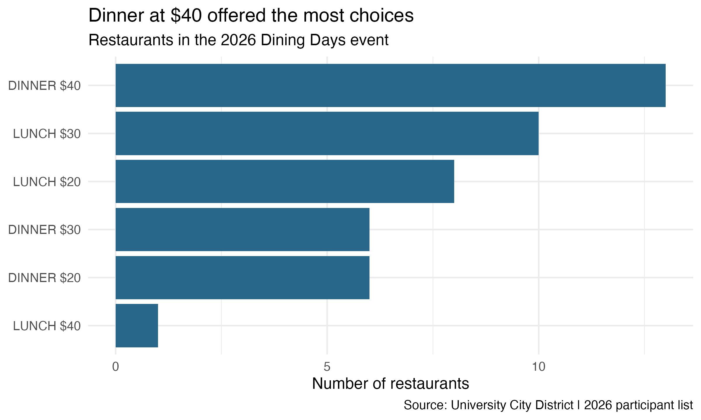

```{r}
#| include: false
source("analysis.R")
```

You and your friends agree to eat out. Then comes the harder part: choosing a place everyone likes at a price everyone can afford. Would spending more give you more options? Or would it help to meet for lunch instead of dinner?

The 2026 University City Dining Days list lets us put some numbers behind that decision. Restaurants offered lunch and dinner menus at $20, $30, and $40. I compared the six groups to see where diners had the most choice. A longer list cannot settle the group chat, but it gives everyone more places to consider.

For this comparison, I used the [official University City Dining Days page](https://www.universitycity.org/diningdays/), first accessed on September 19, 2026. This is a look back at the 2026 event, not a list of deals that are available now. I used R and rvest to collect restaurant names, meal types, and prices from one public page, without bypassing access restrictions. Each run requests the page once, and I avoid repeated downloads.

After removing extra spaces and empty names, the list contained `r nrow(restaurants)` restaurant–meal–price options. I checked for repeated entries within each group. A restaurant offering both lunch and dinner counts in both, since those are separate choices for a diner. Separate cafe deals are not included.



The largest group was dinner at $40, with `r choices$n[choices$meal == "DINNER" & choices$price == "$40"]` restaurants. Lunch at $30 came next, with `r choices$n[choices$meal == "LUNCH" & choices$price == "$30"]`. Those would be good places to start if your group wanted a long list to browse. But the lunch options had a surprise.

The $40 lunch group had only `r choices$n[choices$meal == "LUNCH" & choices$price == "$40"]` restaurant, far fewer than the $30 group. A diner willing to spend $40 could still choose a cheaper menu. The chart compares separate price groups, rather than counting every restaurant below a maximum budget. So the short $40 lunch list does not mean someone with $40 to spend has only one place to go.

For a smaller budget, the more useful comparison is lunch versus dinner. At $20, lunch offered `r choices$n[choices$meal == "LUNCH" & choices$price == "$20"]` restaurants, compared with `r choices$n[choices$meal == "DINNER" & choices$price == "$20"]` for dinner. That gives a group two extra places to consider at the same menu price. If everyone can meet earlier, lunch may make the decision a little easier without asking anyone to spend more.

Of course, a long restaurant list will not tell you whether the food is good or whether a table is available on Friday night. These counts say nothing about portion sizes or dietary options either. Menu prices also exclude tax and tips. The list covers event participants, not every restaurant in University City, so it cannot tell us which area has the best restaurants overall.

## Takeaway

For the 2026 event, I would start with $40 dinner for the widest selection at one price, or $20 lunch for more choices on a smaller menu budget. Before raising the budget, try changing the time of the meal. Before planning a future visit, check the new participant list, menus, and hours, then choose based on what your group actually wants to eat.
