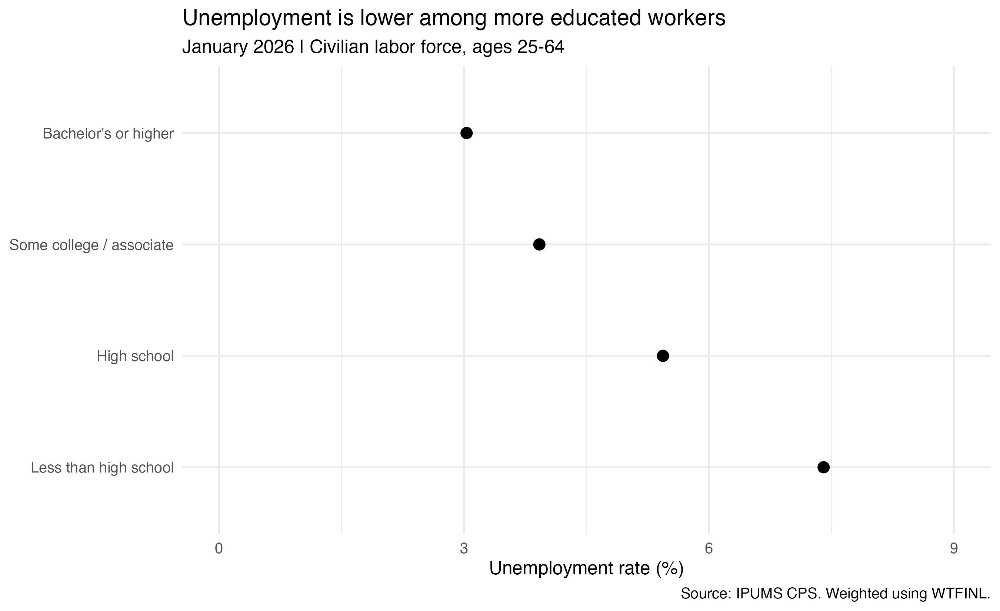
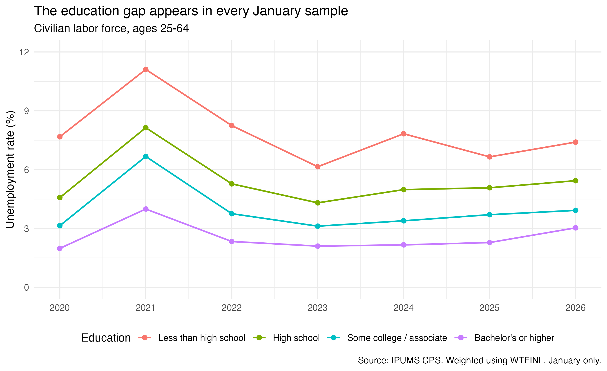
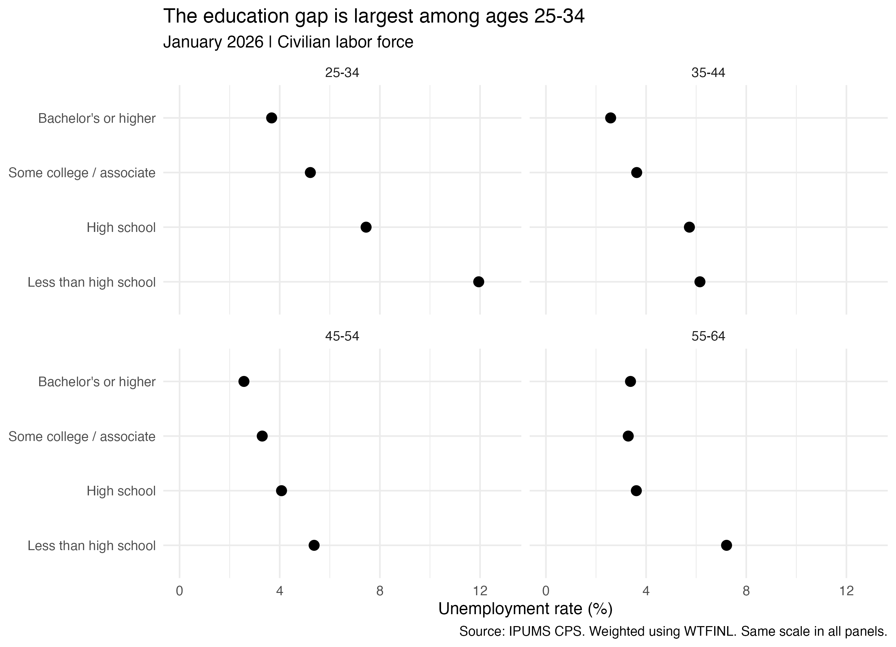

```{r}
#| include: false
source("analysis.R")
```

A degree takes years of work, and often a lot of money. One reason to keep going is the hope of having more job options afterward. But when we look at people who are working or looking for work, how much does unemployment differ by education?

I looked at four education groups in the U.S. The gap is easy to see in January 2026, but one month can only tell us so much. Looking back across several years, and then comparing people of similar ages, helps show whether that first impression holds up.

The data come from the [IPUMS Current Population Survey](https://cps.ipums.org/cps/). I use the Basic Monthly January sample from each year between 2020 and 2026. I focus on civilians ages 25–64 who are in the labor force. I chose this age range because many younger people are still in school, while some older people have already retired.

Being unemployed is different from simply not working. The CPS includes people without a job who are looking for work, as well as people on temporary layoff. People outside the labor force, such as retirees who are not seeking work, are excluded from the rate. The “some college” group includes associate degrees, and the highest education group includes bachelor's and graduate degrees.

The CPS surveys a sample of people, and each person represents a different number of people in the population. I use its Basic Monthly person weight, [WTFINL](https://cps.ipums.org/cps-action/variables/WTFINL), so the rates reflect that difference. Each rate is the weighted share of a group's labor force who are unemployed.



In January 2026, the unemployment rate was `r round(latest$rate[1], 1)`% for people without a high school diploma, compared with `r round(latest$rate[4], 1)`% for people with a bachelor's degree or higher. The difference was about `r round(latest$rate[1] - latest$rate[4], 1)` percentage points. The other two education groups were in between.

That is a noticeable gap. Still, these groups may differ in more than their years at school. They may work in different jobs or have different levels of experience. The chart alone cannot tell us how much of the gap comes from education itself.

Was January 2026 unusual? The next graph takes the comparison back to 2020.



The lines move up and down, but their order stays the same. All four groups had higher unemployment in January 2021 than in January 2020, and rates fell again in 2022 and 2023. The bachelor's-or-higher group had the lowest unemployment rate in every year shown.

There is a catch to this longer view: each point is still just January. These are not annual averages or seasonally adjusted rates. January 2020 was before the major labor market changes caused by the pandemic, so the graph does not show the changes later that year.

Age adds another part of the story. Someone in their late twenties may still be finding a place in the job market, while someone in their fifties may have decades of experience. Splitting the latest sample into age groups gives us a closer comparison.



Among ages 25–34, unemployment was about `r round(age_rates$rate[age_rates$age_group == "25-34" & age_rates$education == "Less than high school"], 1)`% for people without a high school diploma and `r round(age_rates$rate[age_rates$age_group == "25-34" & age_rates$education == "Bachelor's or higher"], 1)`% for those with a bachelor's degree or higher. The gap was smaller in the older groups. The ranking was not exact everywhere: among ages 55–64, the some-college and bachelor's-or-higher rates were very close.

## Takeaway

More education went with lower unemployment in every January sample I compared. The difference was especially large among ages 25–34 in 2026. But even the group with a bachelor’s degree or higher had people looking for work: a degree did not make unemployment disappear.

These numbers give a reason to take education seriously when thinking about job opportunities. They cannot promise what will happen to one person, or prove that another year of school will cause a particular change. Jobs and experience matter too. Small gaps also deserve caution: these are survey estimates, especially for the smaller groups, and I have not tested whether the differences are statistically significant.

Data citation: Sarah Flood et al. (2025). *IPUMS CPS: Version 13.0* [dataset]. Minneapolis, MN: IPUMS. [doi:10.18128/D030.V13.0](https://doi.org/10.18128/D030.V13.0).
