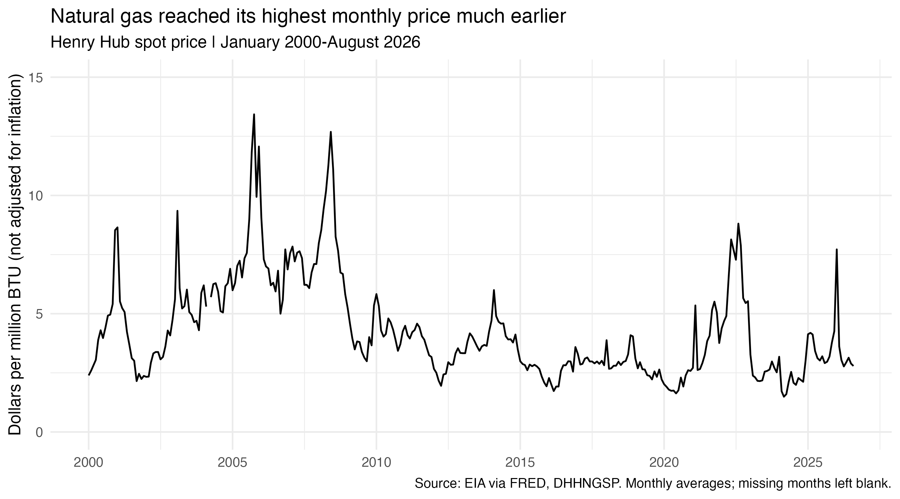
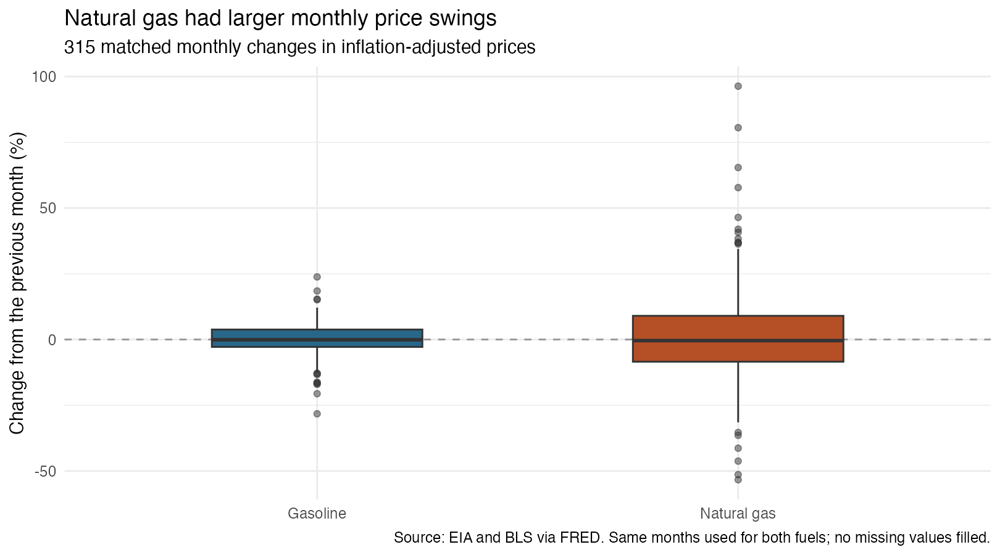

```{r}
#| include: false
source("code/analysis.R")
```

A higher price at the gas station is easy to notice. But does it mean natural gas is becoming more expensive too? Both fuels are often called “gas,” which makes it tempting to talk about them as one energy cost. They are different products, and treating one as a guide to the other could give the wrong picture.

I wanted to separate two questions: which fuel became more expensive after inflation, and which had larger changes from month to month? The difference matters for planning costs. A price can be low compared with the past but still change sharply next month. A business that uses natural gas needs to understand its own price pattern, rather than assume that lower gasoline prices mean lower energy costs everywhere.

I use U.S. regular gasoline and Henry Hub natural gas prices from January 2000 to August 2026. The data come from the Energy Information Administration through FRED: [gasoline](https://fred.stlouisfed.org/series/GASREGW) and [natural gas](https://fred.stlouisfed.org/series/DHHNGSP). R code downloaded monthly averages through the API. I matched the months and used the [Consumer Price Index](https://fred.stlouisfed.org/series/CPIAUCNS) to adjust for inflation. This lets me compare purchasing-power changes, rather than only look at two price lines.


Gasoline's highest monthly dollar price was $`r sprintf("%.2f", gasoline_peak$value[1])` per gallon in `r format(gasoline_peak$date[1], "%B %Y")`. It ended at $`r sprintf("%.2f", last_month$gasoline)` in August 2026. For a driver buying the same number of gallons, a higher price means a larger payment. It does not tell us whether that payment takes a larger share of income, since income and fuel use are not in these data.



Natural gas reached its highest monthly dollar price earlier: $`r sprintf("%.2f", gas_peak$value[1])` in `r format(gas_peak$date[1], "%B %Y")`. It also rose around 2008 and 2022, but neither increase reached that earlier record. Its August 2026 price was $`r sprintf("%.2f", last_month$natural_gas)` per million BTU. So the largest increases did not happen at the same time for both fuels.

The units matter. Gasoline is a retail pump price including taxes; Henry Hub is a wholesale benchmark. It is not a household heating bill, which also depends on delivery charges and usage. Comparing their dollar values directly would not tell us which fuel is cheaper to use.


I put both prices in August 2026 dollars, then set each fuel's January 2000 real price to 100. An index of 150 means a price 50% above its own starting point after inflation. By August 2026, gasoline was about `r round(last_month$gasoline_index - 100)`% above its starting level, while natural gas was about `r round(100 - last_month$natural_gas_index)`% below. These are changes from a chosen month, not a comparison of energy costs per unit of heat.

Inflation also changes the gasoline story. Its real-price peak came in `r format(real_peaks$date[real_peaks$fuel == "gasoline_real"][1], "%Y")`, even though its dollar-price peak came in 2022. A record pump price is not necessarily a record relative to other goods and services.



A lower long-term price did not make natural gas more stable. Across `r movement$months` matched monthly changes, its average change in either direction was `r sprintf("%.1f", volatility$average_absolute_change[volatility$fuel == "Natural gas"])`%, compared with `r sprintf("%.1f", volatility$average_absolute_change[volatility$fuel == "Gasoline"])`% for gasoline. I take absolute values before averaging, so rises and falls do not cancel. The boxes show the middle half of changes, with the line inside marking the median. The wider spread for natural gas shows why its lower ending price alone says little about short-term uncertainty.

The fuels moved in the same direction in only about `r round(movement$same_direction_percent)`% of those months. Their monthly-change correlation was `r sprintf("%.2f", movement$correlation)`, close to zero. Shared peaks in a few years therefore do not mean that their month-to-month changes generally matched.

These results describe this sample, not a forecast or a causal relationship. The series are not seasonally adjusted, and monthly averages hide shorter spikes. Missing natural gas in March 2004 and CPI in October 2025 remain blank. For changes, I exclude a month if either fuel lacks the current or previous real price, using the same months for both fuels.

## Takeaway

Gasoline ended higher after inflation, but natural gas had larger monthly swings. Those are different kinds of price pressure. I would look at both the long-term level and recent changes in the specific fuel being used. A falling price in one energy market is not enough to assume that costs in another will fall too.
