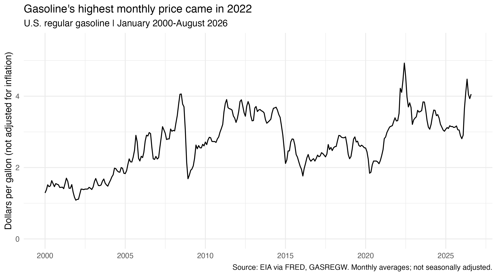
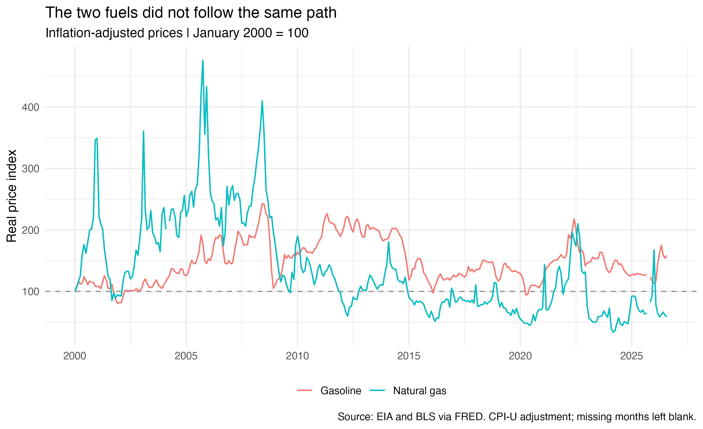

```{r}
#| include: false
source("analysis.R")
```

Energy prices matter because people still need to travel, heat their homes, and pay their bills when prices rise. But “energy prices” covers many different products. If gasoline becomes more expensive, does natural gas usually become more expensive too?

I wanted to compare these two fuels because they are both called “gas,” even though they are used differently and sold in different markets. Looking at only one could give us the wrong impression about energy prices as a whole. Businesses using these fuels may also face different cost changes.

I use U.S. regular gasoline and Henry Hub natural gas prices from January 2000 to August 2026. I compare each fuel over time, then adjust for inflation to put their changes on the same scale.

The data come from the U.S. Energy Information Administration through FRED: [regular gasoline](https://fred.stlouisfed.org/series/GASREGW) and [Henry Hub natural gas](https://fred.stlouisfed.org/series/DHHNGSP). I downloaded them with R using the FRED API. Gasoline is reported weekly and natural gas daily, so I requested monthly averages for both. This makes the timing easier to compare, though it hides short price spikes.



For gasoline, the largest monthly price in this period was $`r sprintf("%.2f", gasoline_peak$value[1])` per gallon in `r format(gasoline_peak$date[1], "%B %Y")`. The line also shows a large rise and fall around 2008, and another low point in 2020. By August 2026, the price was $`r sprintf("%.2f", last_month$gasoline)` per gallon. This means the latest price was below the 2022 peak, but it was still much higher in dollars than at the start of the period. For someone buying the same number of gallons, that would mean a larger gasoline payment. It does not tell us whether gasoline took a larger share of their income, since this dataset does not include income or fuel use.

These prices are in each month’s dollars. Because a dollar in 2000 bought more than a dollar in 2026, I also need to adjust for inflation.


Natural gas did not reach its highest price at the same time as gasoline. Its highest monthly price was $`r sprintf("%.2f", gas_peak$value[1])` per million BTU in `r format(gas_peak$date[1], "%B %Y")`, well before gasoline's peak. It also rose sharply in 2008 and 2022, but those increases did not reach its earlier record. In August 2026, it was $`r sprintf("%.2f", last_month$natural_gas)` per million BTU. Unlike gasoline, its largest monthly price was near the beginning of the period. The later increases were large, but they did not become a lasting move to that earlier price level. So even before adjusting for inflation, the two fuels do not show the same long-term pattern.

There is an important difference between these prices. Gasoline is a retail pump price, including taxes. Henry Hub is a wholesale natural gas benchmark, not a household heating bill. Delivery charges and the amount of fuel used also affect what a household pays. Nor can we compare the two dollar values directly: one buys a gallon, while the other refers to a unit of energy.

To compare their paths, I adjusted both series for inflation using the [Consumer Price Index](https://fred.stlouisfed.org/series/CPIAUCNS). I then set each adjusted price to 100 in January 2000. On this scale, 150 means a real price 50% above its own starting point. It does not mean one fuel costs more than the other for the same amount of energy.



Putting both series on this scale helps answer the original question. Both prices rose around 2008 and 2022, but natural gas spent much of the later period below its starting level. By August 2026, gasoline's real price index was about `r round(last_month$gasoline_index)`, while natural gas was about `r round(last_month$natural_gas_index)`. This puts gasoline about `r round(last_month$gasoline_index - 100)`% above its January 2000 real price, and natural gas about `r round(100 - last_month$natural_gas_index)`% below its own. The difference shows why one fuel is not a reliable guide to the other over this whole period. These percentages depend on the starting month; they are not a measure of which fuel is cheaper to use.

Inflation also changes the comparison within gasoline. Its 2008 high stands above its 2022 high in the adjusted graph, although 2022 had the highest dollar price. A record price at the pump therefore does not always mean a record price compared with the general cost of goods and services.

The lines are not seasonally adjusted. I left missing observations blank: natural gas in March 2004 and CPI in October 2025. These gaps also affect the adjusted comparison. The graphs show price patterns, but cannot tell us which changes came from supply, demand, weather, or policy.

## Takeaway

Gasoline and natural gas sometimes rose together, but they did not follow the same path over the full period. Gasoline ended above its January 2000 price after inflation, while natural gas ended below it. For me, the main lesson is to check the fuel, the type of price, and the time period before drawing a conclusion about energy costs.
